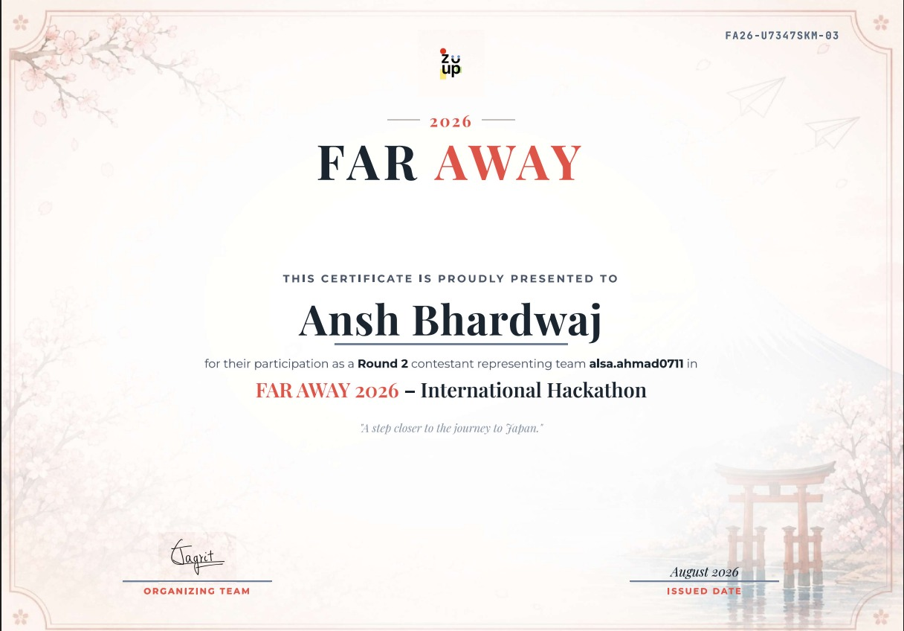
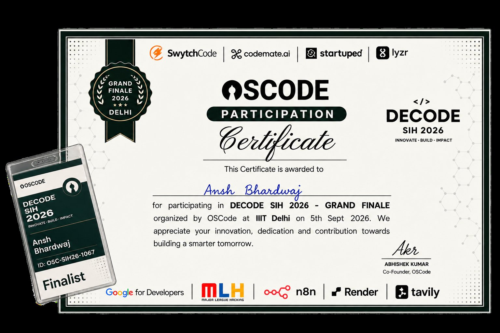
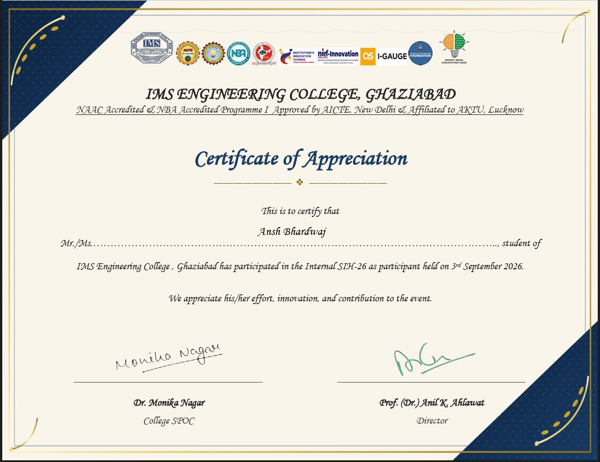
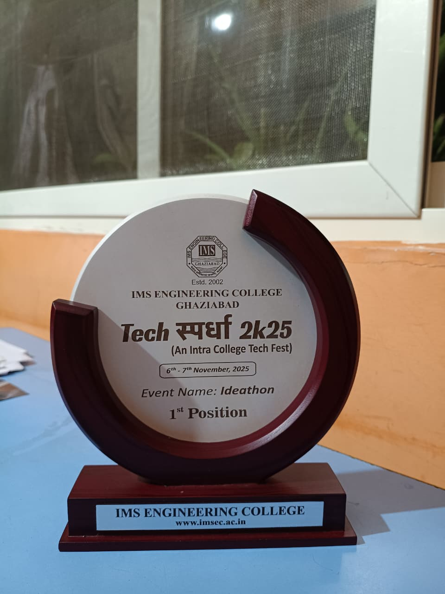
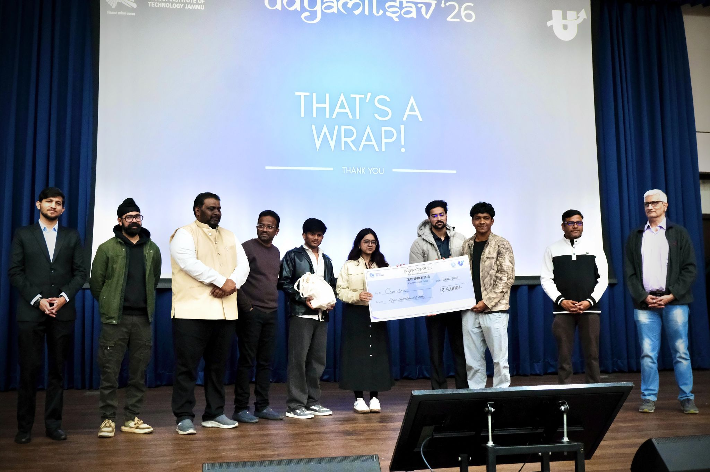
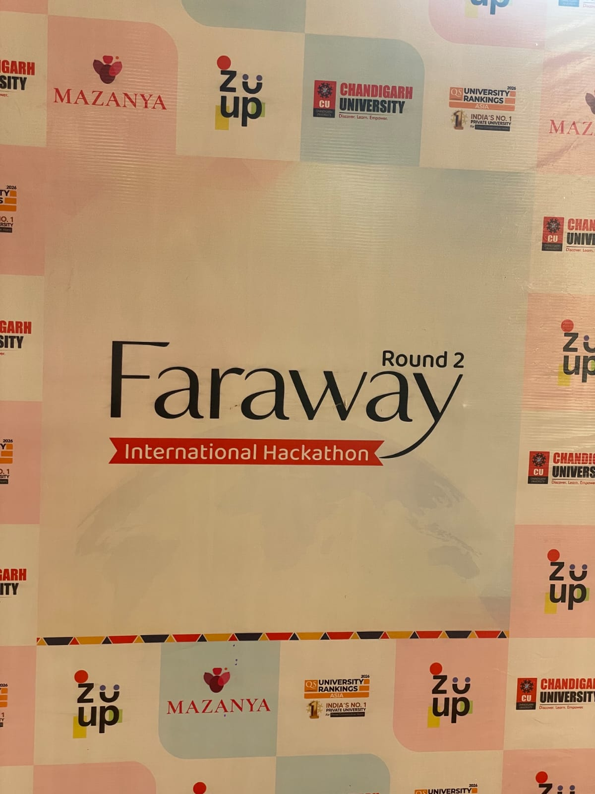
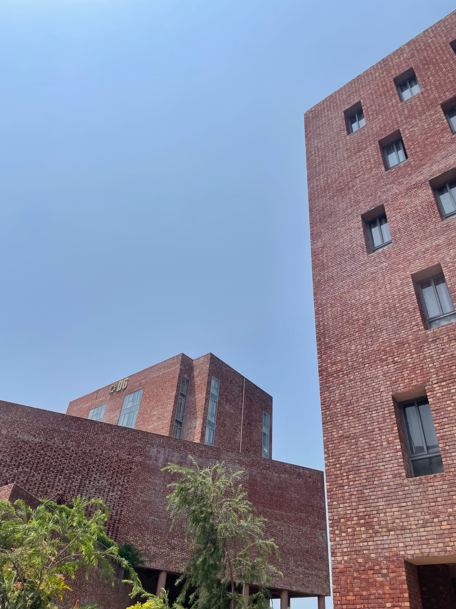

<div align="center">


<br/>

[](https://linkedin.com/in/ansh-bhardwaj-255368324)
[](mailto:anshbhardwaj150507@gmail.com)
[](https://leetcode.com/u/Ansh_bhardwaj____/)
[](https://codeforces.com/profile/Ansh1505Bhardwaj)
[](https://www.geeksforgeeks.org/profile/wwanshbharwn2)


</div>

<br/>

## About Me

```yaml
role:               Backend Systems Engineer (in training)
degree:              B.Tech Information Technology — IMS Engineering College, Ghaziabad (2024–2028)
leadership:          HackerRank Campus Technical Lead (300+ students mentored) · GFG Campus Ambassador (2 terms)
                     AWS Student Builder Group Leader — IMSEC (2026–2027)
currently_building:  AEGIS — real-time emergency response coordination platform
currently_learning:  Distributed systems — concurrency, async orchestration, WebSocket broadcast at scale
looking_for:         Backend engineering internships — FAANG & high-growth product teams
```

I care about the boring parts of engineering that make systems trustworthy — auth that's actually secure, queries that don't fall over at scale, and services that stay observable when something breaks at 2 AM.

<br/>

## 🏳️ Featured Projects

<table>
<tr>
<td width="50%" valign="top">

### AEGIS
**Real-time emergency response coordination platform** — 5 Spring Boot microservices + 3 FastAPI AI services + a live WebSocket command center.

Classifies incident severity via ML, assigns the nearest ambulance, computes the fastest route, triggers a traffic green corridor, matches hospitals by ICU availability, and alerts nearby volunteers — live.

**Stack:** Java · Spring Boot · Python · FastAPI · PostgreSQL · WebSockets/STOMP · Next.js/React · Docker

| Metric | Result |
|---|---|
| P99 Latency | **87ms** |
| Concurrent Users | **1,000+** |
| Query Load Reduction | **50%** |

🇯🇵 **Far Away 2026 International Hackathon** (Chandigarh University) — Top 100 of 13,000+ registrations, currently in Round 2, competing for a fully sponsored trip to Japan

[**Live Demo**](https://lifelineai-git-main-alsas-projects-737cc79e.vercel.app) · [**Repository**](https://github.com/Ansh811-hub/AEGIS.)

</td>
<td width="50%" valign="top">

### IntelliFlow AI
**City traffic decision-intelligence platform** — not navigation, root-cause diagnosis: predicts congestion, explains *why* it's happening via causal AI, and simulates fixes on a live digital twin before a city rolls them out.

Combines congestion prediction, causal root-cause analysis, ACO-based swarm routing, adaptive signal AI, and a SUMO-based digital twin, serving three personas — Traffic Police Command Center, Municipal Engineer, and Citizen.

**Stack:** React/Mapbox/Tailwind · FastAPI · Kafka/MQTT · PostgreSQL/TimescaleDB/Redis · YOLOv11/PyTorch/LightGBM/NetworkX · SUMO · Docker/AWS

Built for **DECODE SIH 2026 — Grand Finale** (OSCode, IIIT Delhi) under track *BHARAT NIRMAN — AI for Smart Cities, Mobility & Infrastructure*, PS1: *AI Traffic Digital Twin for smart traffic optimization and congestion prediction*

[**Repository**](https://github.com/Ansh811-hub/Final_Intelliflow)

</td>
</tr>
</table>

<br/>

## 💼 Experience

**AWS Student Builder Group Leader** · IMS Engineering College · *2026 – 2027*
Founding and leading the campus AWS Student Builder Group — building out an interested-student community from the ground up and running a 6-event program across the year covering cloud fundamentals, architecture, and hands-on AWS labs.

**Campus Technical Lead** · HackerRank — IMSEC · *Jan 2026 – Present*
Organized contests and workshops, growing algorithmic problem-solving participation 60%+. Technical architect across hackathons, delivering production-ready demos in 24–36 hour sprints. Mentored 300+ third-year CSE students in DSA, system design, and interview prep.

**Campus Ambassador** · GeeksforGeeks · *2 consecutive terms*
Ran DSA workshops and mentorship programs across two consecutive terms as GFG Campus Ambassador. Organized and hosted a 300+ attendee offline mentorship event in the college auditorium alongside **Chandhan Jha, Associate Director, GeeksforGeeks**.

**Cloud Virtual Intern** · AWS Academy (AICTE) · *2026*
Completed the 8-week AWS Academy Cloud Foundations and Cloud Architecting courses, earning **Grade O (Outstanding)** — Certificate ID `420a9bc474b5ee28e81e`.

<br/>

## 🧩 Other Projects

**StartupOps** — Multi-tenant startup ops platform · 🏆 **Top 5, Techpreneur — Udyamitsav 2026, IIT Jammu** (100+ teams)
JWT auth + granular RBAC across 200+ concurrent users — cut unauthorized access ~30%, API response time ~25% under load. Modular MVC decoupling task/workflow/user management for independent horizontal scaling.

**Meditrack** — Healthcare management platform · 🥇 **1st Place, Tech Spardha 2k25 Ideathon (IMS Engineering College)**
Real-time patient tracking & scheduling for 100+ concurrent users, cutting hospital workflow overhead ~35%. MongoDB compound indexing cut latency ~30%; RBAC across 3 user tiers.

**ECLYPSE** — Cinematic dark-theme landing page, now expanding into a full-stack project
Frontend: scroll-driven depth animation (GSAP + ScrollTrigger), custom design token system, WCAG-checked contrast — [Live demo](https://ansh811-hub.github.io/EXCLIPSE/). Backend: Spring Boot services actively being built out, moving this from a design showcase into a complete full-stack build.

<br/>

## 🌐 Portfolio

Full portfolio site — in progress. Link goes here once it's live.

<br/>

## 🏆 Hackathons & Recognitions

- 🇯🇵 **Far Away 2026 International Hackathon** (Chandigarh University) — Top 100 of 13,000+ registrations with **AEGIS**; Round 2 contestant, competing for a fully sponsored trip to Japan
- 🥈 **DECODE SIH 2026 — Grand Finale Finalist**, organized by OSCode at IIIT Delhi (Sept 5, 2026) — built **IntelliFlow AI**
- ✅ **Internal SIH-26**, IMS Engineering College (Sept 3, 2026) — participant, college-level Smart India Hackathon round
- 🏆 **Top 5, Techpreneur — Udyamitsav 2026, IIT Jammu** (100+ teams): sole architect of StartupOps, designed and delivered in a 36-hour sprint
- 🥇 **1st Place — Tech Spardha 2k25 Ideathon** (IMS Engineering College, Nov 2025): won with Meditrack's real-time scalable backend and RBAC system
- 🎓 **HackerRank Campus Tech Lead + GFG Ambassador (2 consecutive terms)**: recognized for mentoring 300+ third-year CSE students, building a placement-ready engineering culture campus-wide

<div align="center">


&nbsp;&nbsp;

&nbsp;&nbsp;

<br/>
<sub><i>Far Away 2026 (Chandigarh University) · DECODE SIH 2026 Grand Finale (OSCode, IIIT Delhi) · Internal SIH-26 (IMSEC)</i></sub>

<br/><br/>


&nbsp;&nbsp;

<br/>
<sub><i>Tech Spardha 2k25 · Techpreneur, Udyamitsav 2026, IIT Jammu (100+ teams)</i></sub>

</div>

<br/>

## 📜 Certifications

| Certification | Issuer | Details |
|---|---|---|
| AWS Academy Cloud Foundations | AWS Academy (AICTE) | Certificate ID `420a9bc474b5ee28e81e` |
| AWS Academy Cloud Architecting | AWS Academy (AICTE) | Grade O (Outstanding) |
| [Getting Started with Artificial Intelligence](https://www.credly.com/badges/196cd766-33c6-4eb9-8542-4332c44f1541/linked_in_profile) | IBM | Verified on Credly |
| [Introduction to Cybersecurity](https://www.credly.com/badges/6b05a3b1-e14d-4c5b-8eb1-11cc17930358/linked_in_profile) | Cisco | Verified on Credly |
| [MongoDB Overview: Core Concepts and Architecture](https://www.credly.com/badges/82cd8f89-0f9d-4c6b-a305-f55cb0d9670a/linked_in_profile) | MongoDB | Verified on Credly |
| [Core Computer Science Subject for Interview Preparation](https://media.geeksforgeeks.org/courses/certificates/de4539a79370b252b82b18f891ab3cf9.pdf) | GeeksforGeeks | DSA / OS / DBMS / CN fundamentals |
| [Low Level Design: From Basics to Advance](https://media.geeksforgeeks.org/courses/certificates/f0c0b45481bb2196d7d97259c4aed67b.pdf) | GeeksforGeeks | System design fundamentals |

<br/>

## ⚙️ Tech Stack

<div align="center">


</div>

<br/>

## 📊 GitHub Stats

<div align="center">


</div>

<br/>

## 📌 Snapshot

<div align="center">

| | | | |
|:---:|:---:|:---:|:---:|
| **2** Flagship builds | **6** Hackathons/Ideathons | **1** 1st place win | **3** Top-100 finishes |

</div>

<br/>

## 📷 Moments from the road

<div align="center">

&nbsp;&nbsp;

<br/>
<sub><i>Far Away 2026, Round 2 — Chandigarh University</i></sub>
</div>

<br/>

##  Contribution

<div align="center">
<picture>
  <source media="(prefers-color-scheme: dark)" srcset="https://raw.githubusercontent.com/Ansh811-hub/Ansh811-hub/output/github-contribution-grid-snake-dark.svg">
  <source media="(prefers-color-scheme: light)" srcset="https://raw.githubusercontent.com/Ansh811-hub/Ansh811-hub/output/github-contribution-grid-snake.svg">
  
</picture>
</div>

<br/>

## 📫 Let's Connect

Actively looking for backend engineering internships. If you're hiring, or just want to talk distributed systems, DSA, or system design — reach out.

<div align="center">

[](https://linkedin.com/in/ansh-bhardwaj-255368324)
[](mailto:anshbhardwaj150507@gmail.com)

<br/><br/>


</div>
